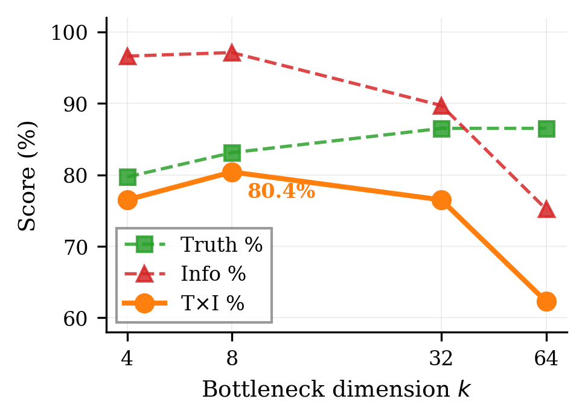
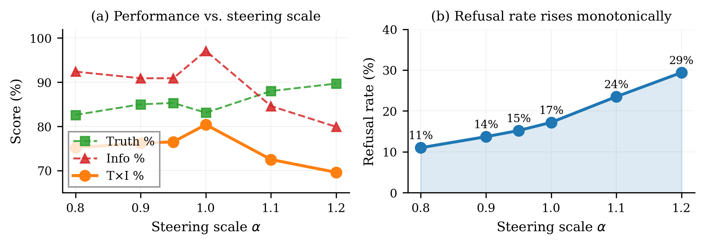
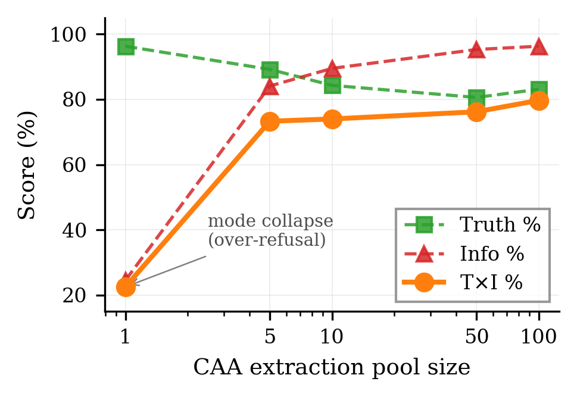
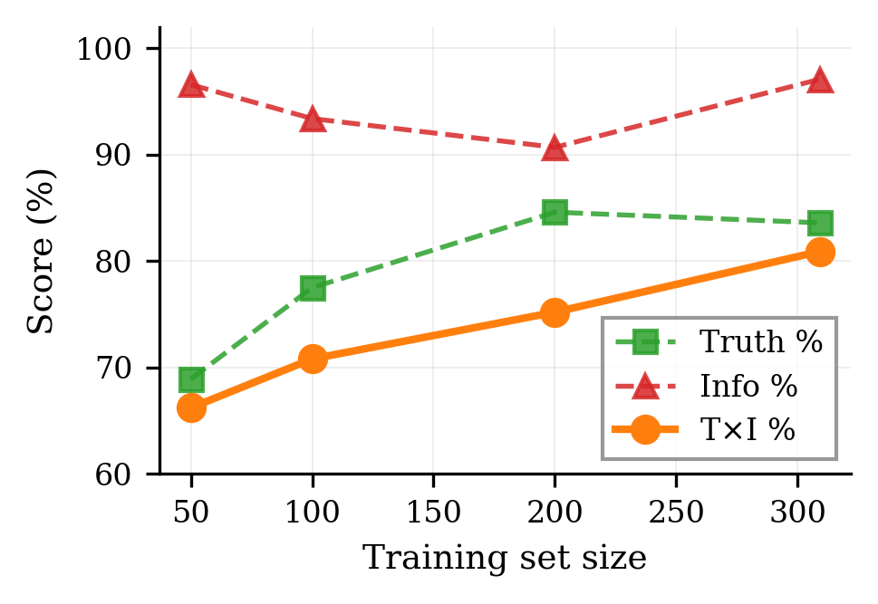
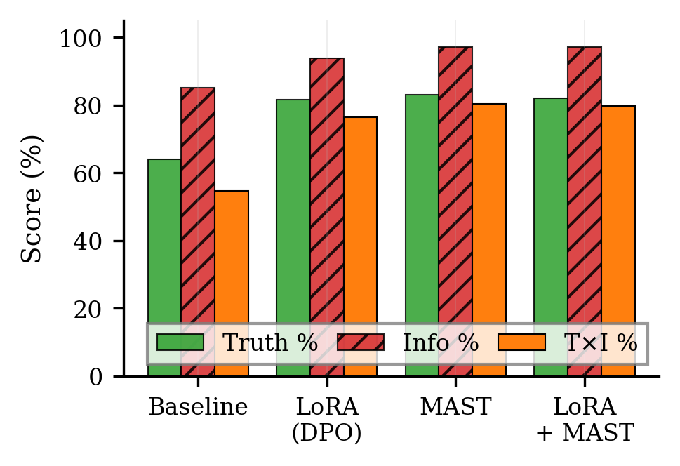
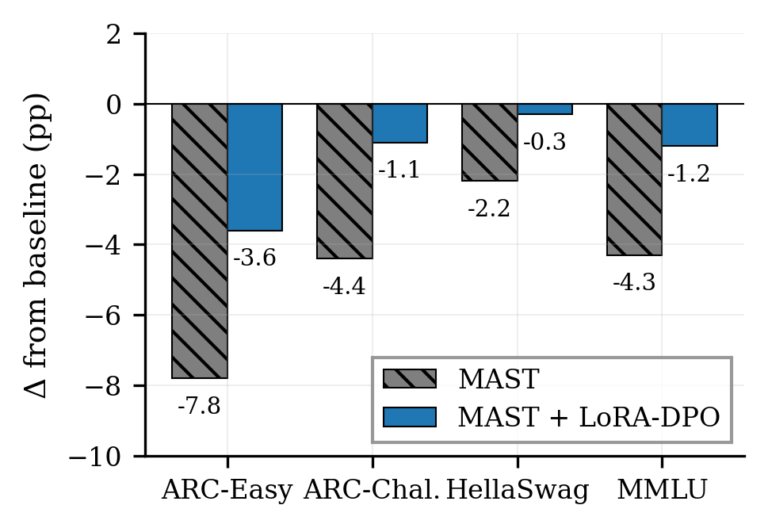

# MAST: Supervised Refinement of Activation Steering Vectors

This repository implements **MAST** (MLP-Augmented Steering Transformation), a
supervised method for refining Contrastive Activation Addition (CAA) steering
vectors with a small residual bottleneck MLP. On TruthfulQA open-ended
generation with LLaMA-2-7B-Chat, MAST matches the published state-of-the-art
fine-tuning method (RaLFiT) on the T×I composite metric while training
**~73× fewer parameters** and intervening in activation space rather than
weight space.

This work is the basis of an MSc by Research thesis at the University of
Warwick (Department of Computer Science, 2026). Its main contribution is
empirical: showing that a small amount of supervised optimisation, applied to
an existing CAA steering vector through a tightly bottlenecked residual MLP,
closes the gap between training-free activation steering and the best
parameter-efficient fine-tuning methods on TruthfulQA.

## Method in one paragraph

CAA produces a steering vector `v` by averaging the difference of residual-stream
activations between contrastive (truthful / untruthful) prompt pairs at a
chosen layer. MAST keeps `v` and learns a small residual correction on top of
it: `f_θ(v) = v + g_θ(v)`, where `g_θ` is a two-layer MLP with a bottleneck
of width `k=8` on a `d=4096` hidden state — about **70K trainable parameters**
in total. The MLP is trained with a contrastive margin loss on a held-out
training split (309 questions) plus a small MSE regulariser that keeps the
correction from dominating the original CAA direction. At inference, the
refined vector `f_θ(v)` is added at residual-stream layer `ℓ=8` with scale
`α=1.0`. The base model's weights are never modified.

## Headline result

TruthfulQA, LLaMA-2-7B-Chat, open-ended generation, GPT-4o-mini judges (same
protocol as the RaLFiT paper).

| Method | Trainable params | Truth% | Info% | T×I% |
|---|---:|---:|---:|---:|
| Baseline (no intervention) | — | 64.1 | 85.1 | 54.6 |
| ITI (activation-space) | — | 65.7 | 83.5 | 54.9 |
| TruthX (activation-space, supervised) | — | 67.8 | 92.7 | 62.8 |
| LoRA-SFT | 5.96M | 69.5 | 83.9 | 58.3 |
| LoRA-DPO | 5.96M | 81.6 | 93.8 | 76.5 |
| RaLFiT (prior SOTA) | 5.11M | 83.0 | 93.3 | 77.4 |
| **MAST (k=8, ours)** | **70K** | **84.3** | **93.5** | **77.9 ± 2.7** |

MAST is the only multi-seed entry (mean ± std over 10 seeds); other rows are
single-run numbers reproduced from Li et al. 2025 (RaLFiT, ACL 2025), Tables 1–2.

## Bottleneck dimension: k=8 is the sweet spot

The MLP's bottleneck width controls a trade-off between truthfulness and
informativeness. As `k` grows, Truth% rises monotonically but Info% collapses —
the model starts refusing to answer ("I don't know", "this is unclear") on
questions it would previously have answered correctly. The composite T×I
peaks at `k=8`. Beyond that, the extra capacity is spent on directions that
push the model into refusal rather than into truthful answers.

| k | Params | Truth% | Info% | T×I% |
|---:|---:|---:|---:|---:|
| 4 | 37K | 79.7 | 96.6 | 76.5 |
| **8** | **70K** | **83.1** | **97.1** | **80.4** |
| 32 | 266K | 86.5 | 89.7 | 76.5 |
| 64 | 528K | 86.5 | 75.2 | 62.3 |



## Steering scale: a behavioural knob on hedging

A useful property of a steering vector is that a single inference-time scalar
should let an operator dial its effect up or down without re-training. We
sweep `α ∈ {0.80, 0.90, 0.95, 1.00, 1.10, 1.20}` keeping the trained MLP
fixed. Truth%, Info%, and T×I respond smoothly to `α` — there is no sharp
regime change — and T×I peaks near the training scale `α=1.0`.

The more interesting finding is in the second panel: **the refusal rate
(fraction of generations containing epistemic-hedge phrases like "I don't
know", "I cannot", "it is unclear") rises monotonically from 11% at α=0.80 to
29% at α=1.20**. The MAST-refined vector behaves, across scales, as a
"caution about confident claims" axis of model behaviour: pushing it up makes
the model abstain more, pushing it down makes it more willing to commit to an
answer. The supervised refinement has not destroyed the interpretable
scaling properties of the original CAA vector; the refined direction is still
a semantic steering vector with a coherent meaning at every scale we tested.



## Data efficiency

MAST is trained on small splits of TruthfulQA itself: a 100-question pool for
CAA extraction and a 309-question split for the supervised MLP step. We sweep
both axes.

The pool-size sweep (left) shows that a single contrastive pair is not enough
— pool=1 gives 22.5% T×I — but performance rises steeply through pool=10
(73–74%) and saturates past pool=50. The training-size sweep (right) shows
that even 50 training examples already exceed every published activation-space
baseline; the slope is steepest in the 100–300 range, and the curve flattens
past ~200 examples. The full 309-example training split sits comfortably in
the diminishing-returns regime.

| | |
|:---:|:---:|
|  |  |

## Composition with LoRA-DPO: preserving downstream capabilities

Because MAST intervenes at a single residual-stream layer and never touches
the base model's weights, it composes cleanly with weight-space adapters. We
train a MAST MLP on top of a LoRA-DPO-adapted model and test in two regimes:
TruthfulQA itself, and four standard reasoning benchmarks (ARC-Easy,
ARC-Challenge, HellaSwag, MMLU).

On TruthfulQA, the combination reaches 79.7% T×I — within the seed-to-seed
variance of MAST alone. The TruthfulQA gain is not the interesting part of
this experiment.

The interesting finding is on **downstream reasoning benchmarks**. MAST
applied alone causes a few-point accuracy drop on tasks unrelated to
truthfulness (ARC-Easy −7.8pp, MMLU −4.3pp, HellaSwag −2.2pp,
ARC-Challenge −4.4pp). Pairing MAST with a LoRA-DPO adapter substantially
reduces this degradation in every case — MMLU improves to −1.2pp, HellaSwag
to −0.3pp, ARC-Challenge to −1.1pp. LoRA-DPO appears to partially compensate
for the residual-stream displacement that MAST induces.
The practical implication is that if downstream reasoning capability matters
in deployment, MAST + LoRA-DPO is empirically cheaper, in terms of
out-of-domain capability loss, than MAST alone, at no cost to TruthfulQA
performance.

(The downstream-benchmark figure was run at `k=16` rather than our default
`k=8` for incidental reasons; the qualitative pattern — LoRA-DPO offsets
MAST's out-of-domain drop — is what the comparison is meant to show.)

| | |
|:---:|:---:|
|  |  |

## Reproducing the experiments

The pipeline runs in four independent stages (extract → train → generate →
score), each with its own resource profile:

```
EXTRACT ──> TRAIN ──> GENERATE ──> SCORE
 1 GPU      2 GPU      1 GPU       1 GPU (or API)
```

1. **Extract**: pull residual-stream activations and form the CAA difference vector
2. **Train**: fit the bottleneck MLP `g_θ` with contrastive margin loss
3. **Generate**: produce steered responses on the held-out split
4. **Score**: evaluate Truth/Info with fine-tuned GPT-4o-mini judges

### Local

```bash
source venv/bin/activate

python -m src.stages.extract  --model llama2_7b_chat
python -m src.stages.train    --model llama2_7b_chat --run-id <from_extract>
python -m src.stages.generate --model llama2_7b_chat --run-id <run_id>
python -m src.stages.score    --model llama2_7b_chat --run-id <run_id>

python scripts/analyze_run.py --model llama2_7b_chat --latest
```

### Remote (SLURM)

```bash
./slurm/submit_full.sh llama2_7b_chat                  # full pipeline with deps
./slurm/submit_pipeline.sh llama2_7b_chat --only extract
./slurm/submit_pipeline.sh llama2_7b_chat --from train --run-id <id>
```

### Reproducing the experiments in this README

| Section | Script / config |
|---|---|
| Main result (10-seed) | `configs/models/llama2_7b_chat_L8_bn8.yaml` × 10 seeds |
| Bottleneck sweep | `configs/models/llama2_7b_chat_L8_bn{4,8,32,64}.yaml`, `scripts/run_sweep.py` |
| Steering scale | `scripts/scale_sweep.py` |
| Pool size | `scripts/sweep_pool_size.py`, `configs/models/llama2_7b_chat_L8_bn8_ind_pool{1,5,10,50,100}.yaml` |
| Training size | `configs/models/llama2_7b_chat_L8_bn8_train{50,100,200}.yaml`, `scripts/run_sweep.py` |
| Noise ablation | `configs/models/llama2_7b_chat_L8_bn16_noise.yaml` |
| LoRA-DPO + MAST | `scripts/train_lora_dpo.py`, `scripts/run_coherence_eval.py` |
| Plots | `scripts/plot_sweep.py`, `scripts/plot_sweep_analysis.py` |

Each stage saves progress incrementally; re-running with the same `--run-id`
resumes from the last checkpoint, and `--force` clears them.

## Repository layout

```
src/
├── stages/        # Pipeline stages: extract, train, generate, score
├── steering/      # CAA extraction, residual MLP, forward hooks
├── evaluation/    # Judge models, MC metrics, similarity probes
├── models/        # Model loading
└── data/          # TruthfulQA splits
configs/           # Base + per-model + per-experiment YAML
slurm/             # SLURM launch scripts
scripts/           # One-off analysis, sweeps, plotting
outputs/           # Run artefacts (gitignored), grouped by family/model/timestamp
assets/figures/    # Figures used in this README
```

## Citation

```bibtex
@mastersthesis{holodnikov2026mast,
  author       = {Dmytro Holodnikov},
  title        = {{MAST}: Supervised Refinement of Activation Steering Vectors
                  for Truthful Language Models},
  school       = {University of Warwick},
  year         = {2026},
  type         = {{M.Sc.}~by Research thesis},
  address      = {Coventry, UK},
}
```
